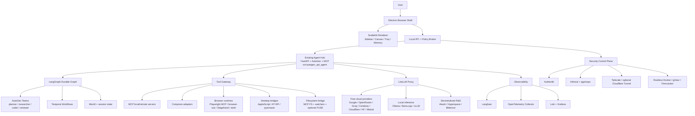
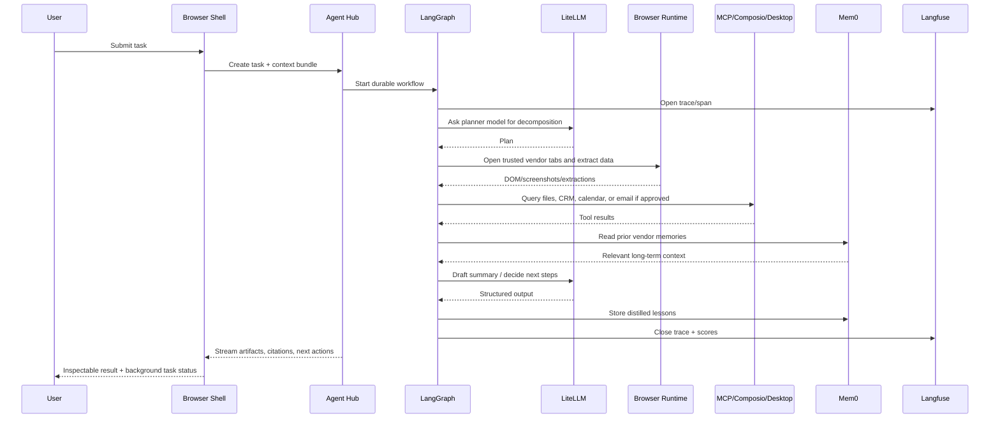
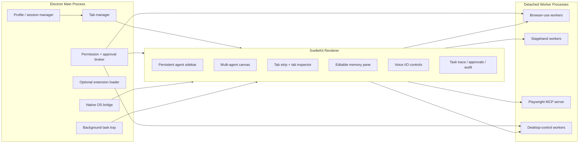
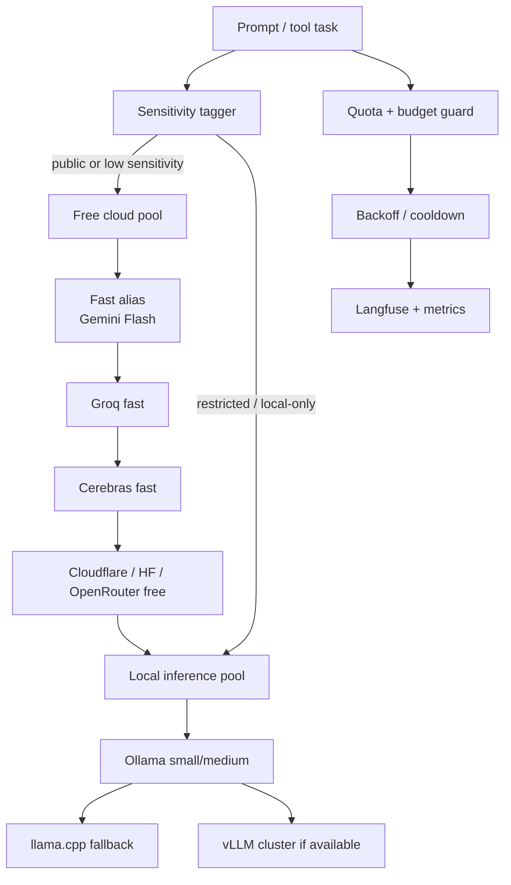
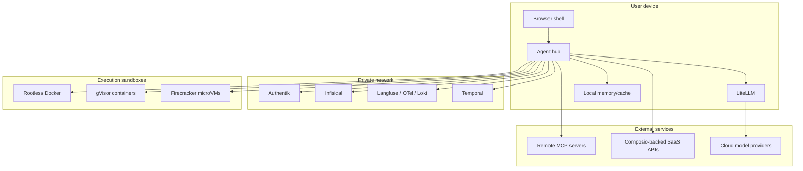

# Final architecture

See also: [component survey](./02-component-survey.md), [repo structure](./04-repo-structure.md), [security](./07-security-threat-model.md).

## 1. Selected architecture

### Core decisions

| Concern | Decision | Why |
| --- | --- | --- |
| Browser shell | Electron app wrapping the existing SvelteKit UI | Fastest path to a sovereign custom browser with deep desktop integration |
| Agent substrate | Keep `src/autogen_api_agent/` as the core API + MCP + team system | Already present and aligned with AutoGen 0.7.5 |
| Orchestration | LangGraph wraps AutoGen teams | Durable state and explicit graph edges around existing team collaboration |
| Browser automation | Playwright MCP + browser-use + Stagehand | Mix of deterministic control and higher-level browser-use reasoning |
| Model routing | LiteLLM proxy | Unified routing across free cloud, local, and experimental decentralized providers |
| Memory | Mem0 for extracted memory, short-term task state in LangGraph/Temporal | Practical separation of episodic and durable memory |
| Background runtime | Temporal | Retries, schedules, resumability, observability hooks |
| Tool plane | MCP first, Composio only for high-friction SaaS auth | Keeps sovereignty high and lock-in low |
| Security | Infisical + Authentik + Tailscale + tiered sandboxes | Self-hostable, operator-friendly zero-trust baseline |

### Selected upstreams

| project | repo | license | stars (approx) | last_commit | selected role |
| --- | --- | --- | ---: | --- | --- |
| Electron | <https://github.com/electron/electron> | MIT | 121.1k | 2026-04-30 | browser shell |
| AutoGen | <https://github.com/microsoft/autogen> | CC-BY-4.0 | 57.6k | 2026-04-06 | existing agent substrate |
| LangGraph | <https://github.com/langchain-ai/langgraph> | MIT | 30.9k | 2026-04-30 | durable orchestration |
| LiteLLM | <https://github.com/BerriAI/litellm> | NOASSERTION | 45.3k | 2026-04-30 | model router |
| Mem0 | <https://github.com/mem0ai/mem0> | Apache-2.0 | 54.5k | 2026-04-29 | long-term memory |
| Temporal | <https://github.com/temporalio/temporal> | MIT | 20.0k | 2026-04-30 | 24/7 workflow runtime |
| Langfuse | <https://github.com/langfuse/langfuse> | NOASSERTION | 26.4k | 2026-04-30 | observability/evals |
| Playwright MCP | <https://github.com/microsoft/playwright-mcp> | Apache-2.0 | 31.8k | 2026-04-30 | browser control surface |

## 2. System topology

## 3. Data flow for a multi-agent web task

Example task: "Research three vendors, compare pricing, draft a summary, and file a decision memo."

## 4. Browser shell internals

### Browser UX contract

The shell should expose five always-visible control surfaces:

1. **persistent sidebar**: one thread per agent or workflow
2. **canvas**: shared document/code/table/diagram space across agents
3. **tab orchestration**: visible mapping from agents to tabs, profiles, permissions, and extraction state
4. **background tray**: pause/resume/retry/inspect long-running workflows
5. **memory pane**: short-term context plus editable long-term memory entries

Voice mode is additive: `whisper` for STT and `piper` for TTS, with local-only mode as the default for sensitive work.

## 5. Model-routing layer

### Routing policy

- default to free cloud models for public-web summarization
- prefer Gemini Flash for low-cost fast reasoning while quota remains
- use Groq/Cerebras as overflow for fast text/code generation
- use OpenRouter free pool only as an opportunistic pool, not a stable primary
- hard-switch to local models for restricted prompts, local files, or secrets-adjacent actions
- optional decentralized inference only behind an explicit experiment flag

## 6. Zero-trust security boundaries

### Boundary rules

- UI renderer never gets raw long-lived provider credentials
- tool execution never talks directly to cloud models; it routes through the agent hub + LiteLLM
- desktop and browser automation run outside the renderer in isolated worker processes
- untrusted code execution goes to Firecracker or gVisor, never the main shell process
- all remote admin access rides over Tailscale or equivalent private mesh

## 7. Orchestration topology by responsibility

| Layer | Primary project | Responsibility |
| --- | --- | --- |
| UX shell | Electron + existing SvelteKit UI | tabs, sidebar, canvas, tray, approvals |
| Interactive API | existing `src/autogen_api_agent/server.py` | streaming/chat entry point |
| Tool protocol | existing `src/autogen_api_agent/mcp_server.py` + MCP | local and remote tool access |
| Team collaboration | AutoGen | multi-agent discussion and specialized roles |
| Durable flow | LangGraph | checkpoints, graph transitions, recovery |
| Background jobs | Temporal | schedules, retries, resumability, alerts |
| Memory | Mem0 | extracted and retrievable long-term memory |
| Observability | Langfuse + OTel + Loki | traces, metrics, audit, evals |
| Model routing | LiteLLM | provider abstraction, fallbacks, budgets |
| Security control plane | Authentik + Infisical + Tailscale + sandboxing | SSO, secrets, network, isolation |

## 8. Why this architecture is executable

- It reuses the current repo for API, MCP, and AutoGen teams.
- Each added concern maps to an existing upstream project instead of a custom subsystem.
- UI and headless workers are separated early, which keeps 24/7 automation from destabilizing the visible browser.
- The model router, tool gateway, and sensitivity tagger make "free-first but safe" practical.
- Security boundaries are explicit enough to test and phase independently.
