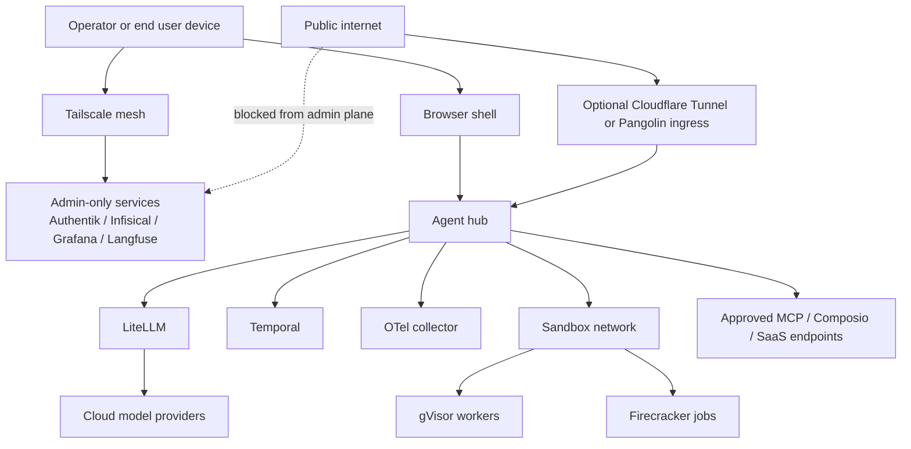

# Security threat model

See also: [architecture](./03-architecture.md), [free-model config](./06-free-models-config.md).

## 1. Security posture summary

Recommended day-1 security stack:

- **identity**: Authentik for SSO, MFA, and service identities
- **secrets**: Infisical for runtime secrets, `age` + `sops` for Git-tracked bootstrap files
- **network**: Tailscale mesh for admin paths, optional Cloudflare Tunnel or Pangolin for inbound access
- **sandboxing**: rootless Docker by default, gVisor for medium-risk workers, Firecracker for untrusted code execution
- **observability**: Langfuse + OTel + Loki/Grafana for prompt/tool/file auditability
- **data classification**: Presidio-backed sensitivity tagger in front of the model router and tool gateway

## 2. Selected security components

| project | repo | license | stars (approx) | last_commit | selected role |
| --- | --- | --- | ---: | --- | --- |
| Infisical | <https://github.com/Infisical/infisical> | NOASSERTION repo-wide; MIT core per docs | 26.4k | 2026-04-30 | runtime secrets plane |
| Authentik | <https://github.com/goauthentik/authentik> | NOASSERTION | 21.3k | 2026-04-30 | SSO / MFA / service auth |
| Tailscale | <https://github.com/tailscale/tailscale> | BSD-3-Clause | 31.1k | 2026-04-30 | private admin network |
| gVisor | <https://github.com/google/gvisor> | Apache-2.0 | 18.2k | 2026-04-30 | medium-risk sandbox |
| Firecracker | <https://github.com/firecracker-microvm/firecracker> | Apache-2.0 | 34.1k | 2026-04-30 | high-risk sandbox |
| OpenTelemetry Collector | <https://github.com/open-telemetry/opentelemetry-collector> | Apache-2.0 | 6.9k | 2026-04-30 | telemetry collection |
| Langfuse | <https://github.com/langfuse/langfuse> | NOASSERTION | 26.4k | 2026-04-30 | prompt/tool traces |
| Presidio | <https://github.com/microsoft/presidio> | MIT | 7.9k | 2026-04-30 | sensitivity tagging |

## 3. Data classification matrix

| class | examples | allowed model routes | storage rule | tool rule |
| --- | --- | --- | --- | --- |
| Public | public web pages, docs, vendor pricing pages | free cloud or local | can be cached locally | browser tools allowed by default |
| Internal | code, notes, issue drafts, non-secret work docs | local preferred; cloud only if org policy allows | local primary, encrypted at rest | write tools need approval |
| Confidential | customer docs, inbox content, private Spaces, internal reports | local only or approved private endpoint | local encrypted storage only | high-risk tools require explicit approval |
| Restricted | credentials, tokens, password-manager context, SSH keys, billing data, regulated data | local only | never leave device/VPC; short retention | deny by default unless dedicated privileged workflow |

## 4. Secrets handling rules

1. Renderer/UI code never receives raw provider or SaaS secrets.
2. Long-lived credentials live in Infisical or OS keychains, not `.env` files on user machines.
3. Git-tracked bootstrap material is encrypted with `sops` + `age`.
4. Desktop-control bridges receive scoped ephemeral credentials or OS automation permissions, never general admin credentials.
5. Model-provider keys are grouped by policy profile and can be disabled centrally.

## 5. STRIDE analysis

| layer | spoofing | tampering | repudiation | information disclosure | denial of service | elevation of privilege | primary mitigations |
| --- | --- | --- | --- | --- | --- | --- | --- |
| Browser renderer | fake UI state or prompt source | malicious extension/content script mutates state | user denies having approved an action | prompt/file content leaks into client logs | hung renderer blocks UX | XSS or preload abuse reaches native APIs | strict preload boundary, CSP, signed builds, approval records |
| Electron main process | fake IPC sender | tab/session policy manipulation | missing action provenance | cookies/tokens leak via process memory | crash stalls browser shell | preload/native bridge abuse | typed IPC contracts, permission broker, least-privileged preload |
| Agent hub API | forged clients or service tokens | task state corruption | missing task history | prompts/tool results leak in logs | overload from runaway agents | unsafe admin endpoints | Authentik service auth, signed session IDs, rate limits |
| LiteLLM router | provider impersonation | routing or fallback manipulation | missing spend/quota history | prompt leakage to wrong provider | quota exhaustion cascades | router admin misuse | sensitivity tagger, provider allowlists, quota budgets |
| Tool gateway / MCP | fake MCP server or hostile remote endpoint | tool output manipulation | agent denies a tool call | filesystem/browser/desktop data exfiltration | tool storms or infinite retries | tool gains broader access than intended | approved registry, per-tool policy, scoped credentials, rate limits |
| Browser automation workers | hostile page drives automation | DOM/screenshot poisoning | unclear which worker acted | screenshots or extracted DOM leak | headless pool saturation | worker escapes into host | per-run profiles, sandboxing, trust labels, isolated workers |
| Desktop bridges | fake app windows or scripts | command injection into bridge | no audit for desktop actions | desktop contents leak to logs/models | bridge stalls or loops | OS-wide automation permissions abused | per-OS allowlists, semantic APIs first, audited approvals |
| Filesystem bridge | path spoofing via symlink tricks | unauthorized file edits | missing write attribution | local files leaked to cloud | recursive watch storms | path traversal reaches system files | root allowlists, canonical path checks, write confirmation |
| Memory store | forged memory entries | memory poisoning | no edit history | private memories exposed | oversized stores slow retrieval | privileged recall into low-trust tasks | editable memory with history, sensitivity labels |
| Observability pipeline | forged traces/logs | log rewriting | inability to prove action history | sensitive prompts leak to SaaS APM | telemetry flood | observability service becomes side-channel | self-hosted OTel/Langfuse/Loki, retention filters |
| Secrets plane | fake secret provider | secret value mutation | no secret access trail | credential theft | secret backend outage | broad operator privileges | Infisical RBAC, audit logs, sealed backups |
| Network edge | fake admin peer or tunnel | MITM or tunnel policy drift | weak ingress audit | metadata leakage | public abuse of endpoints | exposed admin plane | Tailscale-only admin, optional locked-down tunnel ingress |
| Sandbox runtime | fake workload image | sandbox image mutation | weak job provenance | cross-job data leakage | noisy neighbor / VM churn | sandbox escape | signed images, gVisor/Firecracker, ephemeral volumes |

## 6. Sandboxing matrix

| workload type | default isolation | escalation path | selected project |
| --- | --- | --- | --- |
| normal local dev/demo services | rootless container | gVisor if tool risk rises | [moby/moby](https://github.com/moby/moby) |
| browser-use workers on untrusted pages | gVisor container | Firecracker if page executes uploaded code | [google/gvisor](https://github.com/google/gvisor) |
| arbitrary code execution / downloaded artifacts | Firecracker microVM | none | [firecracker-microvm/firecracker](https://github.com/firecracker-microvm/firecracker) |
| small local helper tools | Bubblewrap or OS-native sandbox | gVisor if networked | [containers/bubblewrap](https://github.com/containers/bubblewrap) |

## 7. Network zero-trust diagram

## 8. Sensitivity tagger design

### Recommended implementation

Use a two-step gate:

1. **cheap deterministic checks**: path-based rules, regexes for secrets, entropy checks, protected domains, workflow labels
2. **semantic classification**: Presidio plus local lightweight model for PII/entity detection and contextual confidence

### Routing actions

- `allow_cloud`
- `require_local_model`
- `require_human_approval`
- `deny_external_tools`
- `deny_write_tools`

## 9. Audit and evidence requirements

For every high-risk workflow record:

- user or agent identity
- task ID and workflow ID
- models/providers used
- files touched
- tabs/domains touched
- tools invoked
- approval prompts shown and responses
- output artifact hashes or IDs
- sandbox runtime used

Retention policy:

- traces: 30-90 days by default
- high-risk approvals: 1 year
- raw screenshots/downloads: shortest possible retention, ideally workflow-scoped and auto-expiring

## 10. Recommended defaults

- deny write-capable desktop actions by default
- deny cloud routing for restricted data by default
- disable remote MCP servers by default; require explicit allowlist
- keep admin plane off the public internet
- require a visible kill switch for all long-running workflows
- make every agent work inside a named profile with isolated cookies/storage

## 11. Source list

- [gVisor](https://github.com/google/gvisor)
- [Firecracker](https://github.com/firecracker-microvm/firecracker)
- [Bubblewrap](https://github.com/containers/bubblewrap)
- [Docker / Moby](https://github.com/moby/moby)
- [Infisical](https://github.com/Infisical/infisical)
- [age](https://github.com/FiloSottile/age)
- [sops](https://github.com/getsops/sops)
- [Tailscale](https://github.com/tailscale/tailscale)
- [cloudflared](https://github.com/cloudflare/cloudflared)
- [Pangolin](https://github.com/fosrl/pangolin)
- [Authentik](https://github.com/goauthentik/authentik)
- [Authelia](https://github.com/authelia/authelia)
- [Keycloak](https://github.com/keycloak/keycloak)
- [Ory Kratos](https://github.com/ory/kratos)
- [Ory Hydra](https://github.com/ory/hydra)
- [Presidio](https://github.com/microsoft/presidio)
- [Langfuse self-hosting](https://langfuse.com/self-hosting)
- [Langfuse OpenTelemetry integration](https://langfuse.com/integrations/native/opentelemetry)
