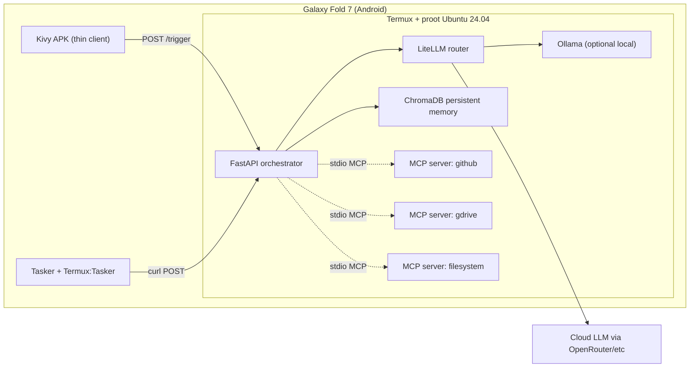

# Architecture

Sovereign Intelligence OS keeps heavy orchestration inside Termux/proot and keeps the APK lightweight. The Android client layer only handles operator interaction and local HTTP dispatch.

Design notes:
- Termux is the trust boundary. The orchestrator binds to `127.0.0.1` by default and should stay local.
- The Python MCP bridge is intentionally declarative. It lists configured servers but does not spawn or supervise them.
- ChromaDB persists recall under `SOVEREIGN_MEMORY_PATH`, defaulting to `~/.sovereign-os/memory`.
- The optional OpenCV bridge uses `termux-screencap` when available.
- The Kivy APK is intentionally thin because `chromadb`, LiteLLM, and OpenCV are poor fits for python-for-android packaging.

Fold 7 considerations:
- Use multi-window mode for a side-by-side cockpit: Kivy UI on one pane, Termux logs or browser on the other.
- Prefer HTTP-triggered workflows over long-running UI automation inside the APK.
- Keep filesystem work rooted in `~/sovereign-workspace` so Termux, MCP filesystem access, and proot tooling share a predictable workspace.
